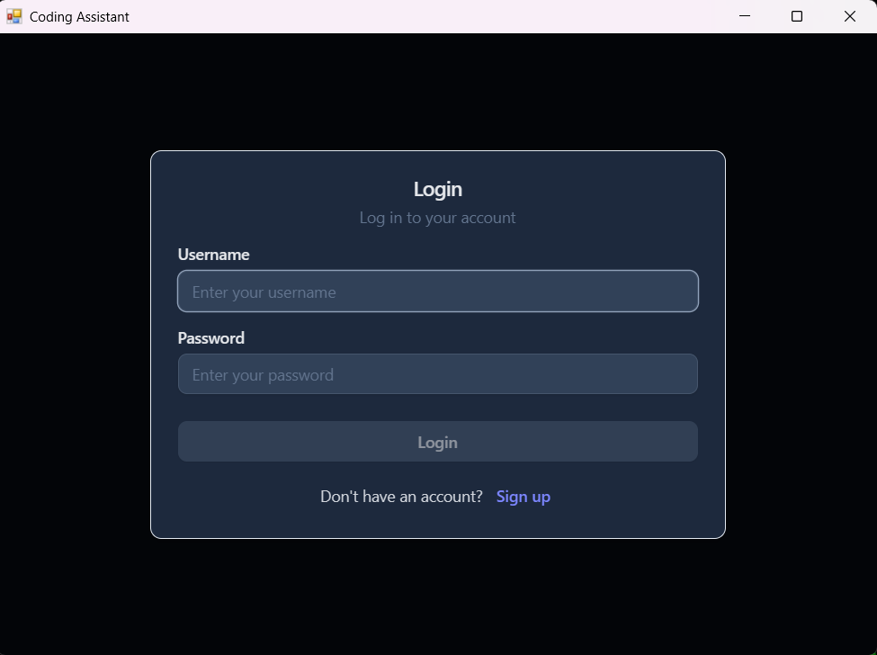
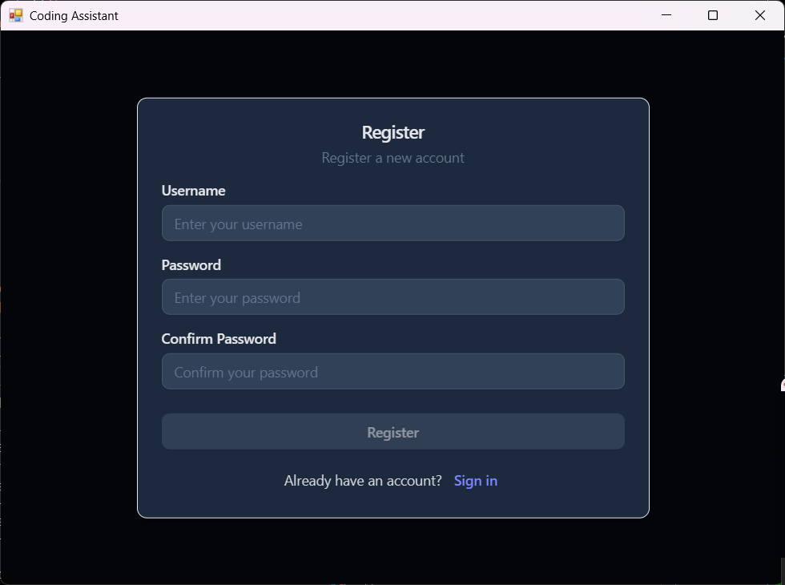
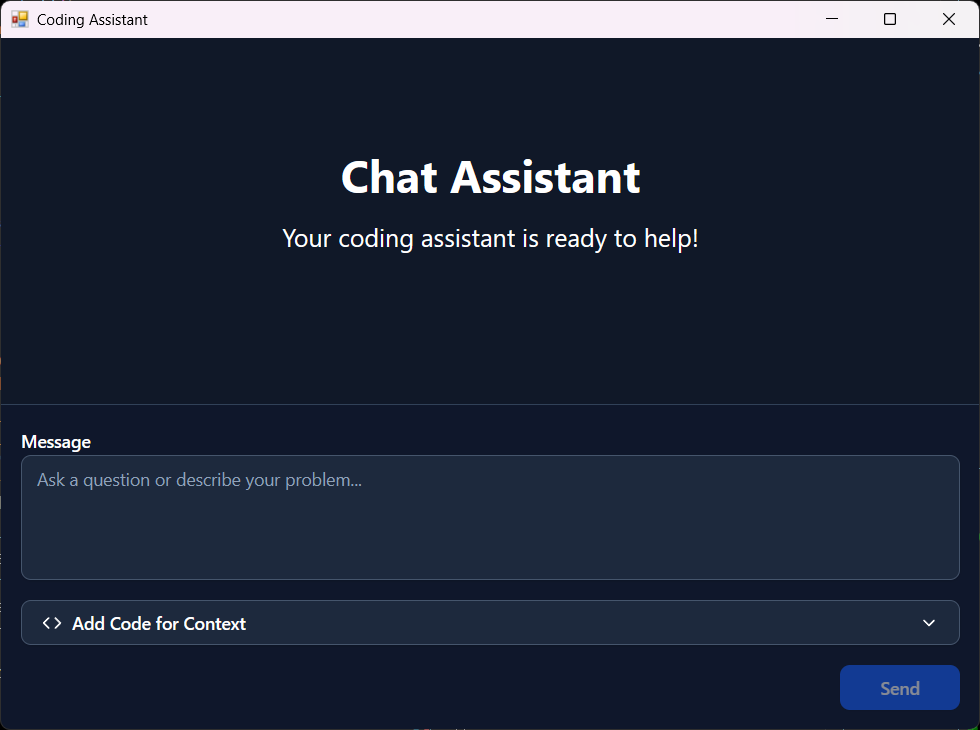
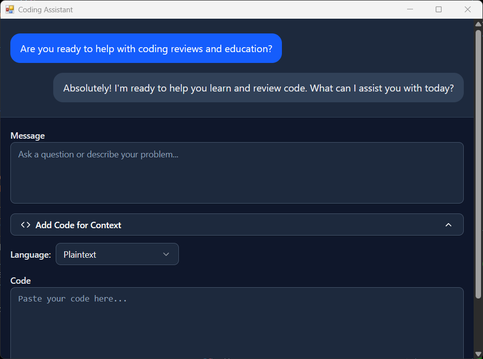
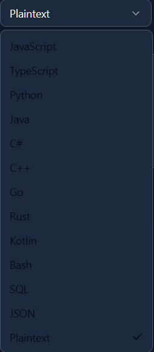

# AI Chat Assistant

A desktop chat application with AI-powered coding assistance, built with modern web technologies and packaged as a native desktop app.

## 🚀 Features

- **AI-Powered Chat**: Integration with Google Gemini AI for intelligent coding assistance
- **User Authentication**: Secure JWT-based login and registration system
- **Code Syntax Highlighting**: Real-time syntax highlighting for multiple programming languages
- **Markdown Support**: Rich text rendering with markdown formatting
- **Desktop Application**: Native desktop experience using Python WebView
- **Rate Limiting**: Token bucket system to manage API usage
- **Responsive Design**: Modern UI with Tailwind CSS and dark theme

## 🛠️ Tech Stack

### Frontend
- **React 18** with TypeScript
- **Vite** for fast development and building
- **Tailwind CSS** for styling
- **ShadCN/UI** for component library
- **React Markdown** for rich text rendering
- **Syntax Highlighting** with Prism.js

### Backend
- **Flask** web framework
- **MongoDB** for data persistence
- **JWT** for authentication
- **Google Gemini API** for AI responses
- **Passlib** for password hashing
- **Python WebView** for desktop packaging

### Development Tools
- **TypeScript** for type safety
- **ESLint** for code quality
- **PostCSS** for CSS processing

## 📋 Prerequisites

- **Node.js** (v18 or higher)
- **Python** (v3.8 or higher)
- **MongoDB** database (local or Atlas)
- **Google Gemini API** key

## Screenshots







## 🔧 Installation

### 1. Clone the Repository
```bash
git clone https://github.com/yourusername/ai-chat-assistant.git
cd ai-chat-assistant
```

### 2. Backend Setup
```bash
cd backend
pip install -r requirements.txt
```

### 3. Frontend Setup
```bash
cd frontend
npm install
```

### 4. Environment Configuration
Copy the example environment file and configure your settings:
```bash
cp backend/.env.example backend/.env
```

Edit `backend/.env` with your credentials:
```env
MONGODB_URL=your_mongodb_connection_string
GEMINI_API_KEY=your_gemini_api_key
JWT_SECRET_KEY=your_secure_jwt_secret_key
```

## 🚀 Running the Application

### Development Mode
```bash
# Terminal 1 - Start Frontend
cd frontend
npm run dev

# Terminal 2 - Start Backend + Desktop App
cd backend
python app.py
```

### Production Build
```bash
# Build frontend
cd frontend
npm run build

# Run production server
cd backend
python app.py
```

## 🏗️ Architecture

```
┌─────────────────┐    ┌─────────────────┐    ┌─────────────────┐
│   React Frontend │    │   Flask Backend │    │   MongoDB       │
│   (Port 5173)   │◄──►│   (Port 5000)   │◄──►│   Database      │
└─────────────────┘    └─────────────────┘    └─────────────────┘
         │                       │                       │
         │                       │                       │
         ▼                       ▼                       ▼
┌─────────────────┐    ┌─────────────────┐    ┌─────────────────┐
│   WebView       │    │   JWT Auth      │    │   User Data     │
│   Desktop App   │    │   Middleware    │    │   Chat History  │
└─────────────────┘    └─────────────────┘    └─────────────────┘
                                │
                                ▼
                       ┌─────────────────┐
                       │   Gemini AI     │
                       │   API           │
                       └─────────────────┘
```

## 🔐 Security Features

- **Password Hashing**: Argon2 algorithm for secure password storage
- **JWT Tokens**: Stateless authentication with expiration
- **Rate Limiting**: Token bucket system to prevent API abuse
- **Input Validation**: Comprehensive validation on both frontend and backend
- **CORS Protection**: Configured for secure cross-origin requests

## 📱 Usage

1. **Registration**: Create a new account with username and password
2. **Login**: Authenticate to access the chat interface
3. **Chat**: Ask coding questions or request help with debugging
4. **Code Input**: Use the collapsible code section to provide context
5. **Language Selection**: Choose from 13+ programming languages
6. **Markdown Rendering**: Responses include formatted code and text

## 🎯 Key Technical Achievements

- **Full-Stack Development**: Complete application from UI to database
- **AI Integration**: Seamless integration with Google's Gemini AI
- **Modern Frontend**: React with TypeScript and modern tooling
- **Authentication System**: Secure JWT-based user management
- **Desktop Packaging**: Web app packaged as native desktop application
- **Error Handling**: Comprehensive error boundaries and user feedback
- **Performance**: Optimized with Vite build system and efficient state management

## 📊 Project Statistics

- **Languages**: TypeScript, Python, CSS
- **Components**: 8+ React components
- **API Endpoints**: 3 REST endpoints
- **Database Collections**: Users, Chat History
- **Dependencies**: 50+ npm packages, 15+ Python packages

## 🤝 Contributing

1. Fork the repository
2. Create a feature branch (`git checkout -b feature/amazing-feature`)
3. Commit your changes (`git commit -m 'Add amazing feature'`)
4. Push to the branch (`git push origin feature/amazing-feature`)
5. Open a Pull Request

## 📄 License

This project is licensed under the MIT License - see the [LICENSE](LICENSE) file for details.

## 🙏 Acknowledgments

- Google Gemini AI for intelligent responses
- ShadCN for beautiful UI components
- The React and Flask communities for excellent documentation

---

**Built with ❤️ by [Your Name]**

*This project demonstrates full-stack development capabilities, AI integration, and modern web technologies.*